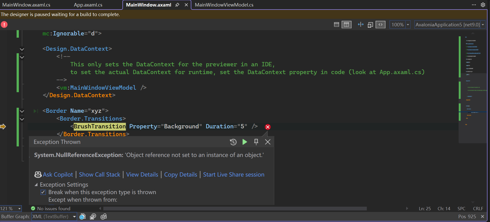
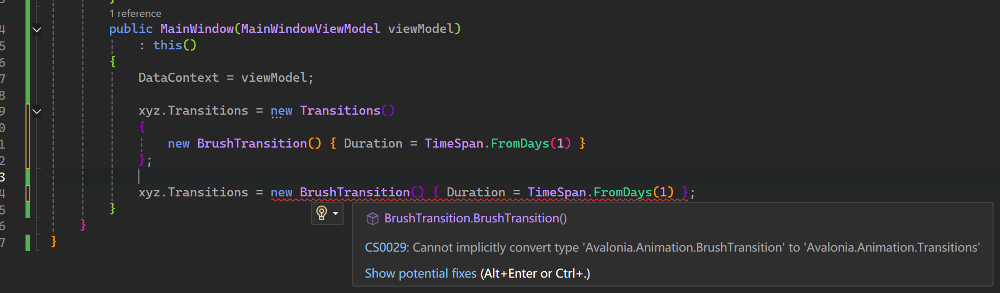

# Transitions
组件的`Transitions`属性无法设置为`BrushTransition`类型，导致`NullReferenceException`异常。
``` title="错误信息"
System.NullReferenceException: 'Object reference not set to an instance of an object.'
```
``` title="MainWindow.xaml"
<Border Name="xyz">
    <Border.Transitions>
        <BrushTransition Property="Background" Duration="5" />
    </Border.Transitions>
</Border>
```


## 解决方案

```diff title="MainWindow.xaml"
    <Border Name="xyz">
        <Border.Transitions>
++			<Transitions>
				<BrushTransition Property="Background" Duration="5" />
++			</Transitions>
        </Border.Transitions>
    </Border>
```

## 为什么

`Transitions`属性的类型是`Transitions`，而不是`BrushTransition`。`Transitions`是一个集合，可以包含多个过渡效果。

```csharp title="Transitions.cs"
public sealed class Transitions : AvaloniaList<ITransition>, IAvaloniaListItemValidator<ITransition>
{
    ...
}
```

```csharp title="BrushTransition.cs"
public class BrushTransition : Transition<IBrush?>
{
    ...
}
```

查看源码可以发现，一个是集合，一个是集合元素。
