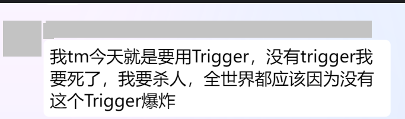

# Trigger

Avalonia 没有 Trigger

??? danger
    

## 猜你想找

[如何绑定样式类 | Avalonia Docs](https://docs.avaloniaui.net/zh-Hans/docs/guides/data-binding/binding-classes#example)

[伪类（Pseudoclasses） | Avalonia Docs](https://docs.avaloniaui.net/zh-Hans/docs/reference/styles/pseudo-classes)

[内置数据绑定转换器 | Avalonia Docs](https://docs.avaloniaui.net/zh-Hans/docs/reference/built-in-data-binding-converters)

@github:thomasgalliker/ValueConverters.NET

[DataTriggerBehavior.xaml in wieslawsoltes/Avalonia.Xaml.Behaviors](https://github.com/wieslawsoltes/Avalonia.Xaml.Behaviors/blob/master/samples/BehaviorsTestApplication/Views/Pages/DataTriggerBehaviorView.axaml)
